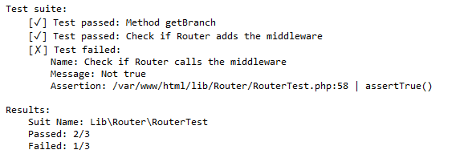

# Testing

You can test your code with "Testing" package of this library.



> [!Warning]
Minimum PHP version for this package is PHP7.

## Basic Test

```php
Test::it("test", function (Test $test) {
    $test->assertEqual(1, 2);
});
```

## Suite Test

```php
Test::suite("test", function ($it) {
    $it("test", function (Test $test) {
        $test->assertEqual(1, 1);
    });
    $it("test", function (Test $test) {
        $test->assertEqual(1, 2);
    });
});
```

## Suite Test with Class

```php
class RouterTest extends Router
{
    /**
     * Test get branch
     * @test Branch Getter Test
     * @since 1.0.0
     */
    public function getBranchTest(Test $test): void
    {
        // Test get branch
        $this->getBranch('/a/b', false)[] = 'test';
        $test->assertArrayContains($this->getBranch('/a/b', false), 'test');
        // Test by popping the last element
        $this->getBranch('/a/b/test', true)[] = 'test';
        $test->assertArrayContains($this->getBranch('/a/b', false), 'test');
    }
}


$router = new RouterTest();
Test::suiteClass($router);
```
